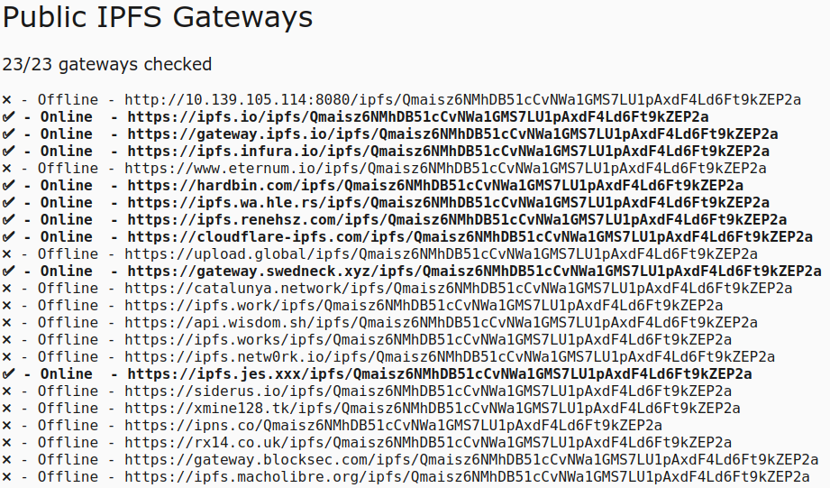

# 星际文件系统IPFS

## IPFS公有网关
不需要自己搭建网关，利用公有网关，连接到IPFS网络。

### 列表
https://ipfs.github.io/public-gateway-checker/



1. 一段文字  
https://ipfs.infura.io/ipfs/Qmaisz6NMhDB51cCvNWa1GMS7LU1pAxdF4Ld6Ft9kZEP2a
2. 一张图片  
https://ipfs.infura.io/ipfs/QmdUmT1pEWNoGQtWVMQQJNuvLU9vDRptAqqZ6HYhfvHFKn

## IPFS私有网关
需要自己搭建网关，利用私有网关，连接到IPFS网络。

### 安装
[Download IPFS for your platform](https://dist.ipfs.io/#go-ipfs)
```
$ tar xvfz go-ipfs.tar.gz
$ cd go-ipfs
$ ./install.sh
```

### 配置
```
$ ipfs init
$ ipfs config --json API.HTTPHeaders.Access-Control-Allow-Origin '["*"]'
$ ipfs config --json API.HTTPHeaders.Access-Control-Allow-Methods '["PUT", "GET", "POST"]'
```

### 运行
```
$ ipfs daemon
```

### 控制台
We also have a web console you can use to check the state of your node. On your favorite web browser, go to:
```
http://localhost:5001/webui
```
This should bring up a console like this:


## 代码
```
// 1. 创建公有网关方式
IPFS ipfs = new IPFS("/dnsaddr/ipfs.infura.io/tcp/5001/https");

// 2. 创建私有网关方式
IPFS ipfs = new IPFS("/ip4/127.0.0.1/tcp/5001");
```

```
// 上传字节流
byte[] b = "Hello from IPFS Gateway Checker\n".getBytes();
NamedStreamable.ByteArrayWrapper file = new NamedStreamable.ByteArrayWrapper(b);
MerkleNode node = ipfs.add(file).get(0);
String hash = node.hash.toString();
System.out.println(hash);
```

```
// 上传文件
File f = new File("src/main/resources/bg.jpg");
NamedStreamable.FileWrapper file = new NamedStreamable.FileWrapper(f);
MerkleNode node = ipfs.add(file).get(0);
String hash = node.hash.toString();
System.out.println(hash);
```

```
// 下载
Multihash CID = Multihash.fromBase58(hash);
byte[] content = ipfs.cat(CID);
System.out.println(new String(content));
```
